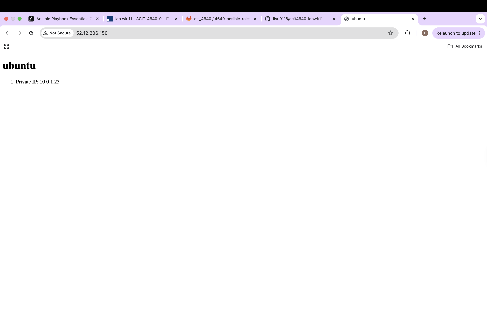

# 4640-ansible-roles-lab

## Ansible Commands

```bash
ansible-inventory -i inventory/aws_ec2.yml --graph
```
Verifies that the AWS EC2 dynamic inventory is loading correctly

```bash
ansible-playbook -i inventory/aws_ec2.yml playbook.yml
```
Runs the playbook and applies the Redis and Frontend roles to their respective servers

## Frontend Server Screenshot

Below is the HTML page served by the Ubuntu frontend server:



